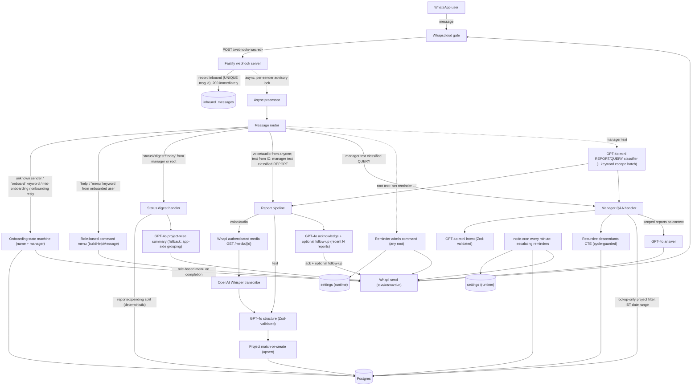

# WhatsApp Daily-Reporting Bot (Narang Realty)

A single Node.js + TypeScript service that runs a WhatsApp daily-reporting bot on
top of the [Whapi.cloud](https://whapi.cloud) gate. Every team member — ICs and
managers alike — sends a daily update as a **text message or a voice note**; the
bot transcribes voice (Hindi/Hinglish/English), uses an LLM to structure the
update, auto-discovers the project it's about, stores it, and replies with an
acknowledgement plus an optional context-aware follow-up. Managers can ask
free-text questions scoped to their own org subtree, request a daily status
digest, and (if they are a top-level root) retune the reminder schedule over
WhatsApp. An escalating minute-cron reminder engine nudges anyone who hasn't
reported yet today.

---

## What it does

- **Onboarding over WhatsApp** — a new sender is onboarded with just **name +
  manager** (phone is captured automatically from the WhatsApp JID; team and
  is-manager are never asked). Triggered by a `wa.me` deep link with prefilled
  `onboard` text, or the `onboard` keyword.
- **Daily updates (text or voice)** — a voice note is downloaded, transcribed
  with Whisper, and structured with GPT-4o; text is structured directly. Each
  update becomes exactly one stored report (deduped on the Whapi message id),
  linked to auto-discovered project(s), and answered with an acknowledgement (+
  optional follow-up drawn from the user's recent reports).
- **Manager Q&A** — a manager's text question is answered grounded **only** in
  the reports of people transitively below them (their subtree). Multiple
  top-level CXO roots are supported; each sees only their own subtree.
- **Daily status digest** — a manager/root can type `status` (or `digest` /
  `today`) to get a deterministic reported-vs-pending split for today plus a
  GPT-4o project-wise summary of their subtree's updates.
- **Role-based help menu** — sent automatically on onboarding completion and on
  the `help` / `menu` keyword; the menu adapts to the user's derived role.
- **Escalating reminders** — a minute cron nudges anyone with no report today,
  starting at a runtime-configurable time, repeating every configurable
  interval, until they submit or a stop cutoff. Any root can retune this live
  over WhatsApp.

---

## Architecture

One Fastify service receives Whapi webhooks with a **fast-ack + durable
idempotent inbox**, then asynchronously processes each sender's messages under a
per-sender Postgres advisory lock. Persistence is Supabase Postgres via `pg` +
plain SQL migrations. OpenAI provides transcription, structuring, classification,
intent extraction, answering, and the digest summary.



`src/index.ts` is the **single composition root** — the only file that imports
every concrete handler. The router and processor depend only on the injectable
`Handlers` interface (`domain/types.ts`), so they compile and unit-test without
the concrete report/query/digest handlers.

---

## Environment variables

Copy `.env.example` → `.env` and fill in the secrets. Validated at start-up by
`src/config.ts` (missing/invalid required vars throw immediately).

| Var | Required | Example / default | Purpose |
|---|---|---|---|
| `PORT` | yes | `8080` | HTTP port (exposed publicly) |
| `WHAPI_TOKEN` | yes | (secret) | Bearer token for Whapi |
| `WHAPI_BASE_URL` | no | `https://gate.whapi.cloud` | Whapi gate base URL |
| `OPENAI_API_KEY` | yes | (secret) | OpenAI auth (a `OPENAI_API_KEY__DEMO` alias is also accepted) |
| `OPENAI_CHAT_MODEL` | no | `gpt-4o` | structuring + answering + acknowledge/follow-up + digest summary |
| `OPENAI_CLASSIFY_MODEL` | no | `gpt-4o-mini` | intent extraction + REPORT/QUERY classification |
| `DATABASE_URL` | yes | (secret) | Supabase Postgres (`?sslmode=require`) |
| `WEBHOOK_SECRET` | yes | random hex | Secret path segment for the webhook route |
| `REMINDER_TZ` | no | `Asia/Kolkata` | Timezone for **evaluating** reminder start/interval/stop |
| `REMINDER_START` | no | `17:00` | Default first-reminder time (seeds `settings.reminder_start`) |
| `REMINDER_INTERVAL_MIN` | no | `15` | Default repeat interval minutes (seeds `settings.reminder_interval_min`) |
| `REMINDER_STOP` | no | `22:00` | Default end-of-day cutoff (seeds `settings.reminder_stop`) |
| `RECENT_REPORTS_FOR_FOLLOWUP` | no | `5` | How many recent reports feed the acknowledge/follow-up LLM call |
| `BOT_NUMBER` | no | — | Bot's WhatsApp number (intl digits, no `+`); docs only, used to build the `wa.me` deep link |
| `PROJECT_MATCH_THRESHOLD` | no | `0.45` | pg_trgm similarity cutoff for project matching |
| `MAX_MEDIA_BYTES` | no | `26214400` | media size guard (~25MB, OpenAI limit) |
| `SEED_CEO_PHONE` / `SEED_CEO_NAME` | no | — / `Gopal Narang` | optional bootstrap of a top-level root user |

### Timezone & data semantics — important

- **Report/query day semantics are FIXED to `Asia/Kolkata`** (`util/dates.ts`),
  regardless of `REMINDER_TZ`. "Today", "last 7 days" and "this week" are always
  IST calendar days, so reports stay comparable no matter where the server runs.
- `REMINDER_TZ` **only** affects how the reminder `[start, stop]` window and
  interval are evaluated — never the report day.
- The three reminder schedule values (`reminder_start`, `reminder_interval_min`,
  `reminder_stop`) **live in the runtime `settings` table**. The env vars only
  seed the initial values; live values are changed at runtime via any root
  user's WhatsApp admin commands (or a direct `UPDATE settings ...`).

---

## Setup

```bash
cd Daily-Reporting-WA-Bot
npm install

# 1. Configure env / secrets
cp .env.example .env
#   set WHAPI_TOKEN, OPENAI_API_KEY, DATABASE_URL, WEBHOOK_SECRET (random hex),
#   PORT=8080, and optionally BOT_NUMBER + SEED_CEO_PHONE / SEED_CEO_NAME.

# 2. Apply migrations (idempotent — advisory lock + migration ledger)
npm run migrate

# 3. Seed reference data (idempotent)
npm run seed
```

`npm run seed` upserts the demo **projects** (Narang Vivenda, Narang Privado,
Narang Valora, Narang Bangur Nagar, Asteria by Courtyard, Windsor Grande
Residences, Windsor BKC) with normalized names, the optional reference **teams**,
the reminder **settings** defaults (from env, only if absent), and — if
`SEED_CEO_PHONE` is set — an optional top-level **CXO root** (`SEED_CEO_NAME`,
default "Gopal Narang"). Multiple roots are allowed, so seeding one doesn't stop
others from onboarding at the top level. The seed is safe to re-run.

---

## Running

```bash
# Dev (auto-reload)
npm run dev

# Production
npm run build
npm start          # runs dist/src/index.js
```

On start the service:
1. Loads + validates config (fails fast on missing required env).
2. Opens the pg pool and constructs the Whapi + OpenAI-backed dependencies.
3. Wires the concrete handlers into the router and the async processor.
4. Starts Fastify listening on `0.0.0.0:$PORT` (reachable when the port is
   exposed) and logs the listening URL, `/health`, and the local webhook path.
5. **Starts the minute reminder cron automatically** (`* * * * *`).

Graceful shutdown on `SIGINT` / `SIGTERM` stops the cron, closes the Fastify
server, and drains the pg pool.

### Health check

```bash
curl http://localhost:8080/health      # → {"status":"ok"}
```

---

## Exposing the server & configuring Whapi

1. Expose the port to get a public URL, e.g.:
   ```bash
   port expose --port 8080
   ```
   This yields a public host like `https://<public-host>`.
2. In the **Whapi dashboard**, set the channel webhook to:
   ```
   https://<public-host>/webhook/<WEBHOOK_SECRET>
   ```
   - **Method:** `POST`
   - **Events:** `messages`
   Whapi does not sign webhooks; the secret path segment is the protection — any
   request whose `:token` doesn't match `WEBHOOK_SECRET` gets a `404`.

### Onboarding deep link (`wa.me`)

Share this link with the team to start onboarding in one tap:

```
https://wa.me/<BOT_NUMBER>?text=onboard
```

- `wa.me` is the correct host.
- `BOT_NUMBER` is the bot's WhatsApp number in **international digits, no `+`**
  (e.g. `919812300000`). It is used only to build this link (`BOT_NUMBER` env).
- Tapping it opens a 1:1 chat to the bot prefilled with the text `onboard`,
  which starts the onboarding flow. Any first message from an unknown sender also
  starts onboarding, so the prefill is a convenience.

---

## Message routing rules (precedence)

`src/domain/router.ts` is the single source of truth. Rules are evaluated in
this fixed order:

1. **Onboarding trigger** — if the sender is unknown or `onboarding_state != done`,
   route to onboarding regardless of content. The `onboard` keyword
   (case-insensitive, trimmed) from a not-in-flow sender (re)starts onboarding.
2. **Help / menu keyword** — an onboarded user whose message is exactly `help`
   or `menu` gets `buildHelpMessage(user)`. Checked **before** report/query
   classification; applies to IC, manager, and root.
3. **Status / digest keyword** — `status`, `digest`, or `today` from a
   **manager (derived `is_manager`) or root** → the status digest handler.
   Checked **after** help/menu and **before** the admin/report/query ladder. For
   a plain IC (no descendants, not root), these words are **not** a command —
   they fall through to normal report handling.
4. **Voice / audio from anyone → REPORT.** Always.
5. **Text from a non-manager → REPORT.**
6. **Text from a manager → disambiguate** in this fixed order:
   1. **Root admin command** (any `is_root` user): `set reminder time HH:MM`,
      `set reminder interval <min>`, `set reminder stop HH:MM` → update
      `settings`, ack, done.
   2. **Keyword escape hatch:** `report:` → REPORT; `ask:` / `query:` → QUERY
      (keyword stripped).
   3. **Cheap heuristics:** trailing `?` or an interrogative prefix
      (`what|who|when|where|why|how|which|is|are|did|does|can|show|list`) → QUERY.
   4. **LLM classifier** (`gpt-4o-mini`, Zod-validated) → REPORT vs QUERY.
   5. **Fallback → QUERY** (safer: a misfiled report is recoverable by resending;
      a report answered as a query leaks nothing).

Stale/unknown button/list reply ids received outside onboarding are rejected
with a hint (not treated as a query).

**Precedence:** onboarding trigger → help/menu → status/digest (managers/roots)
→ admin (root) → report/query.

---

## Role-based commands

Roles are **derived**: `is_manager` is true when a user has ≥1 descendant;
`is_root` marks a top-level CXO (`manager_id = NULL`). Multiple co-equal roots
are supported, each scoped to their own subtree.

- **Everyone (IC, manager, root):**
  - Send your daily update anytime as **text or a voice note**.
  - `help` / `menu` — show the role-based command menu.
- **Managers (≥1 descendant) additionally:**
  - Ask free-text questions about their team, e.g. *"What's happening with
    Narang Vivenda?"* or *"What did Sana do this week?"* — answered only over
    their subtree.
  - `status` / `digest` / `today` — the daily status digest (reported/pending
    split + project-wise summary).
- **Top-level roots (`is_root`) additionally:**
  - Retune reminders live over WhatsApp:
    - `set reminder time 17:30` — first-reminder time
    - `set reminder interval 15` — repeat interval (minutes)
    - `set reminder stop 22:00` — end-of-day cutoff
  - Any root may run these; changes take effect on the next minute tick.

### Escalating reminders

Anyone onboarded with no report for today's IST day is nudged once now ≥
`reminder_start`, then again every `reminder_interval_min` minutes, until they
submit a report or `reminder_stop` passes. Submitting a report stops the nudges.
The cron runs every minute and re-reads the runtime settings each tick.

---

## Demo runbook

A scripted walk-through of a small multi-root org tree. (`is_manager` is derived;
everyone reports; the help menu is role-based.)

1. `npm install`
2. Set env/secrets in `.env`: `WHAPI_TOKEN`, `OPENAI_API_KEY`, `DATABASE_URL`,
   `WEBHOOK_SECRET` (random hex), `PORT=8080`,
   `REMINDER_TZ`/`REMINDER_START`/`REMINDER_INTERVAL_MIN`/`REMINDER_STOP`,
   `RECENT_REPORTS_FOR_FOLLOWUP`, `BOT_NUMBER`, and optional
   `SEED_CEO_PHONE`/`SEED_CEO_NAME`.
3. `npm run migrate` then `npm run seed`.
4. `npm run dev` (or `npm run build` + `npm start`) — the minute reminder cron
   starts automatically.
5. `port expose --port 8080` → public URL.
6. Whapi dashboard webhook = `https://<public-host>/webhook/<WEBHOOK_SECRET>`,
   POST, events = `messages`.
7. Share the onboarding deep link: `https://wa.me/<BOT_NUMBER>?text=onboard`.

**Walk-through:**

- **Phone A** — tap the deep link → onboarding → name **"Gopal Narang"** →
  manager = **"I'm at the top level / I have no manager"** → A is a top-level
  root. On completion A gets the role-based menu (basic + reminder-admin lines).
- **Phone B** — name **"Advait Narang"** → manager = **either** "I'm at the top
  level" (B becomes a *second* co-equal root — both accepted, no rejection)
  **or** select **Gopal Narang** (B onboards under Gopal). Both choices are
  valid; multiple CXOs at the top are allowed. B gets its own menu.
- **Phone C** — name **"Rohit Shah"** → manager = **Advait Narang** → Advait now
  has a descendant (derived `is_manager=true`); Advait's next `help` includes the
  team-query line.
- **Phone D** — name **"Sana Khan"** → manager = **Rohit Shah** → Rohit derived
  as manager. Branch: Advait → Rohit → Sana.
- **Any user — `help` / `menu`**: returns the role-appropriate menu (IC: update
  line only; manager: + team-query + daily-status; root: + reminder-admin).
- **Phone D — text daily update**: *"Aaj Narang Vivenda me 3 site visits kiye, 2
  bookings closed, ek approval pending hai"* → stored (`source_kind=text`, linked
  to "Narang Vivenda") + acknowledgement.
- **Phone D next day — voice daily update**: a Hindi/Hinglish voice note
  (*"Windsor Grande Residences ka client meeting hua, pricing finalize karna
  hai"*) → transcribed + structured (`source_kind=voice`) + acknowledgement and
  a **contextual follow-up** referencing yesterday's still-pending approval.
  Re-sending the same note does not duplicate (dedup on message id).
- **Phone C (manager, Rohit) — manager also reports**: *"report: Aaj Sales
  review kiya, targets on track"* → forced REPORT via the keyword hatch; acked.
- **Phone B (root, Advait) — manager query**: *"What's happening with Narang
  Vivenda?"* and *"What did Sana do this week?"* → QUERY; grounded answers over
  **Advait's own subtree only** ("this week" resolved to a concrete IST Mon..today
  range in app code). A co-equal root like Gopal does not see Advait's branch.
- **Phone B (root, Advait) — daily status digest**: text `status` (or `digest` /
  `today`) → (1) a deterministic *"✅ Reported (…): …\n⏳ Pending (…): …"* split
  across Advait's subtree for today's IST day, and (2) a GPT-4o **project-wise
  summary** of today's reports (grouped by project + an "Other updates" bucket).
  A plain IC (e.g. Sana) texting `status` is treated as a normal report, not a
  command.
- **Phone A or B (any root) — runtime reminder retune**: *"set reminder time
  17:30"* and *"set reminder interval 10"* → bot acks; `settings` updated live
  (no restart).
- **Reminders**: anyone with no report by `reminder_start` (default 17:00 IST)
  is nudged, repeating every interval until they submit or `reminder_stop`
  (default 22:00 IST). To demo immediately, trigger a sweep manually via
  `runReminderSweep(new Date())` from the reminder engine.

---

## Testing

```bash
npm test          # vitest run
```

The suite mixes fast unit tests (mocked network) with **real-Postgres** suites
that run against the sandbox `DATABASE_URL` (subtree isolation, multi-root
constraints, concurrent project upserts, digest queries). External APIs (Whapi /
OpenAI) are stubbed in the flow tests. The real-DB suites TRUNCATE mutable tables,
so re-run `npm run seed` afterwards if you need seeded rows.

```bash
npm run build     # tsc — must stay clean
```

---

## Project structure

```
Daily-Reporting-WA-Bot/
├─ migrations/            # 0001_init, 0002_seed_reference, 0003_multi_root
├─ scripts/
│  ├─ migrate.ts          # advisory-lock + ledger migration runner
│  └─ seed.ts             # projects + optional teams + settings + optional CXO root
└─ src/
   ├─ index.ts            # composition root (the only file wiring all concretes)
   ├─ config.ts           # typed env loader (zod)
   ├─ server.ts           # Fastify: POST /webhook/:token (fast-ack), GET /health
   ├─ processor.ts        # async inbox drain; per-sender advisory lock
   ├─ db/{pool,queries}.ts
   ├─ whapi/{client,types}.ts
   ├─ openai/{client,transcribe,structure,followup,query}.ts
   ├─ domain/
   │  ├─ types.ts         # injectable Handlers interface
   │  ├─ router.ts        # routing ladder (single source of truth)
   │  ├─ onboarding.ts    # name + manager state machine (multi-root, help on done)
   │  ├─ reportPipeline.ts# text/voice → structure → projects → store → ack+followup
   │  ├─ projects.ts      # normalize + matchOrCreate + findByNorm
   │  ├─ settings.ts      # runtime reminder settings + admin-command parsing
   │  ├─ help.ts          # buildHelpMessage (role-based menu)
   │  ├─ digest.ts        # status digest (reported/pending + project summary)
   │  └─ query.ts         # manager Q&A orchestration
   ├─ cron/reminders.ts   # minute cron; escalating per-user cadence
   └─ util/{dates,phone,hierarchy,projectName,logger}.ts
tests/                    # vitest suites (unit + real-Postgres)
```
